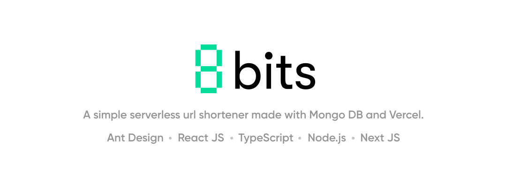
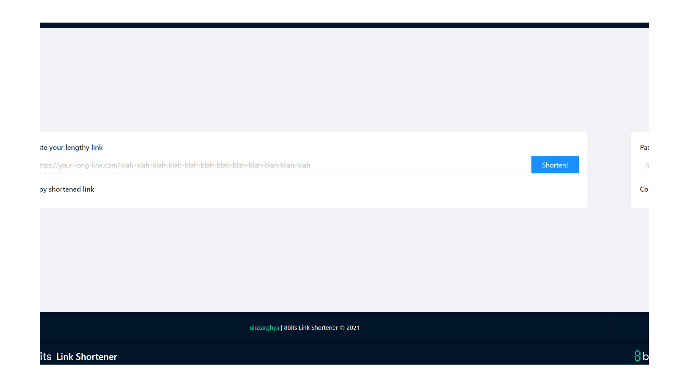

# **8bits Link Shortner**

 
 

    <b><h2>8bits LInk Shortener - A simple serverless url shortener.</h2></b>
  

  

     <i>Helps you shorten long links for easy sharing. 
  

  

    Built with ❤︎ by
      <a href="https://github.com/uiuxarghya">uiuxarghya</a>
    
  

  

 

## **About**

### A simple serverless url shortener made with [Mongo DB](https://mongodb.com) and [Vercel](https://vercel.com).

## **Demo**

[8bits.vercel.app](https://8bits.vercel.app)

## [**Documentation**](https://github.com/uiuxarghya/8bits/wiki)

Check the detailed documentation at our [wiki](https://github.com/uiuxarghya/8bits/wiki) page.

## **Features**

❤️ **Lightweight:** Crafted with minimalistic UI design.

⚡️ **Fast:** Paste long url and get/copy short url in less than a second.

## **Developing**

1. Create a `.env.local` file repository's root directory with your own keys.

_Sample keys only works with the [production build](https://8bits.vercel.app)._

### Browser based development environment

### Local development environment

1. [Clone this repo](https://help.github.com/en/articles/cloning-a-repository) with git.
2. Install dependencies by running `npm install` within the directory that you cloned (probably `8bits`).
3. Start the development server with `npm run dev`.
4. Open development site by going to [`http://localhost:3000`](http://localhost:3000) in your browser.

## **Deploy now with Vercel**

## **Changelog**

See the [`CHANGELOG`](CHANGELOG.md) file for details.

## **Authors**

### Lead Developers

- **[Arghya Ghosh](https://github.com/uiuxarghya)** - _Author_

## **License**

This project is licensed under the [Apache-2.0 License](https://opensource.org/licenses/Apache-2.0) - see the [`LICENSE`](LICENSE) file for details.
